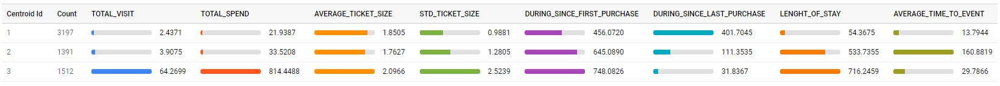

## Campaign Response Model
   

## Dataset
เป็นข้อมูล Transections ของ Supermarket แห่งหนึ่งที่บอกว่าลูกค้าซื้อสินค้าอะไรบ้าง จากร้านค้าสาขาไหน ช่วงวันที่เท่าไหร่ มีจำนวนข้อมูลทั้งหมด 956,575 Transections และเป็นข้อมูลระหว่างช่วง 2006/04 ถึง 2008/07

## Objective
ทดสอบใช้ BigQuery ML เพื่อสร้าง Clusters ของลูกค้าและแปลผล

## Steps
1. Upload Supermarket Data.csv ไปที่ Google Cloud Storage
2. สร้าง K-means Model ผ่าน BigQuery ตามไฟล์ kmeans.sql และทดลองเปลี่ยนจำนวน Cluster ตั้งแต่ 2-8 Clusters

## Feature Engineering
จากข้อมูลที่มี ได้ทำการสร้าง Feature เพิ่มเติมทั้งหมด 8 Features เพื่อเป็นตัวแทนไปหา K-means ได้แก่
- TOTAL_VISIT จำนวนครั้งรวมการซื้อของลูกค้าแต่ละราย
- TOTAL_SPEND จำนวนเงินรวมที่ใช้ไปของลูกค้าแต่ละราย
- AVERAGE_TICKET_SIZE ค่าเฉลี่ยของยอดซื้อของลูกค้าแต่ละราย
- STD_TICKET_SIZE ส่วนเบี่ยงเบนมาตรฐานของยอดซื้อของลูกค้าแต่ละราย
- DURING_SINCE_FIRST_PURCHASE ระยะเวลาจากการเริ่มมี Transaction ครั้งแรก
- DURING_SINCE_LAST_PURCHASE ระยะเวลาจากการมี Transaction ล่าสุด
- LENGHT_OF_STAY ระยะเวลาของการเป็นลูกค้า
- AVERAGE_TIME_TO_EVENT ค่าเฉลี่ยของระยะเวลาที่เป็นลูกค้า

## Result
จากการทดลองเปลี่ยนค่า K เรื่อย ๆ ได้เลือกค่า K = 3

ผลลัพธ์จากการทำ K-means ได้กลุ่มทั้งหมด 3 กลุ่ม โดย
- กลุ่มที่ 1 มีจำนวน 3,197 คน ซึ่งมีจำนวนการซื้อน้อย ยอดซื้อน้อย ไม่ได้มาซื้อของที่ร้านนานแล้ว เรียกลูกค้ากลุ่มนี้ว่า "ลูกค้าขาจร"
- กลุ่มที่ 2 มีจำนวน 1,391 คน ซึ่งมีจำนวนการซื้อน้อย ยอดซื้อน้อย มีการมาซื้อของเป็นช่วง ๆ เป็นลูกค้ามาประมาณ 2 ปี เรียกลูกค้ากลุ่มนี้ว่า "ลูกค้าที่นาน ๆ มาซื้อของ และซื้อครั้งละไม่มาก"
- กลุ่มที่ 3 มีจำนวน 1,512 คน ซึ่งมีจำนวนการซื้อมาก ยอดซื้อมาก มีการมาซื้อของเป็นประจำ เป็นลูกค้ามานานกว่า 2 ปี เรียกลูกค้ากลุ่มนี้ว่า "ลูกค้าชั้นดี (Loyalty)"