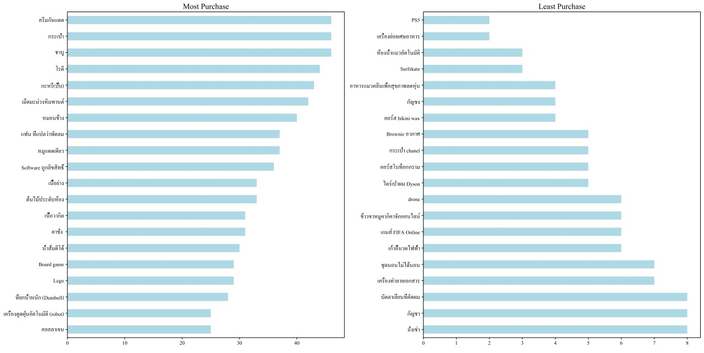
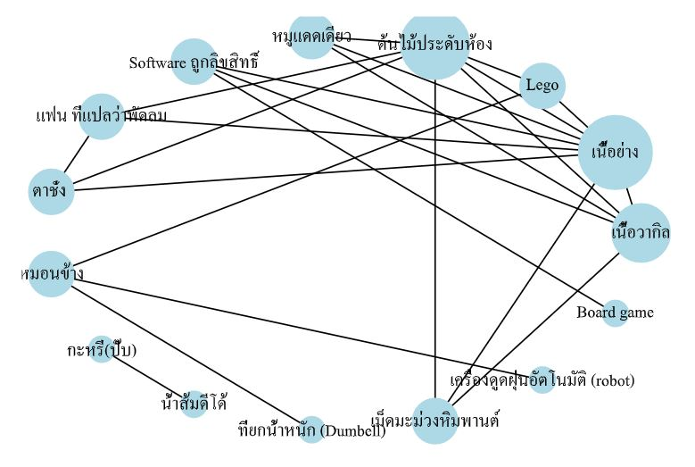
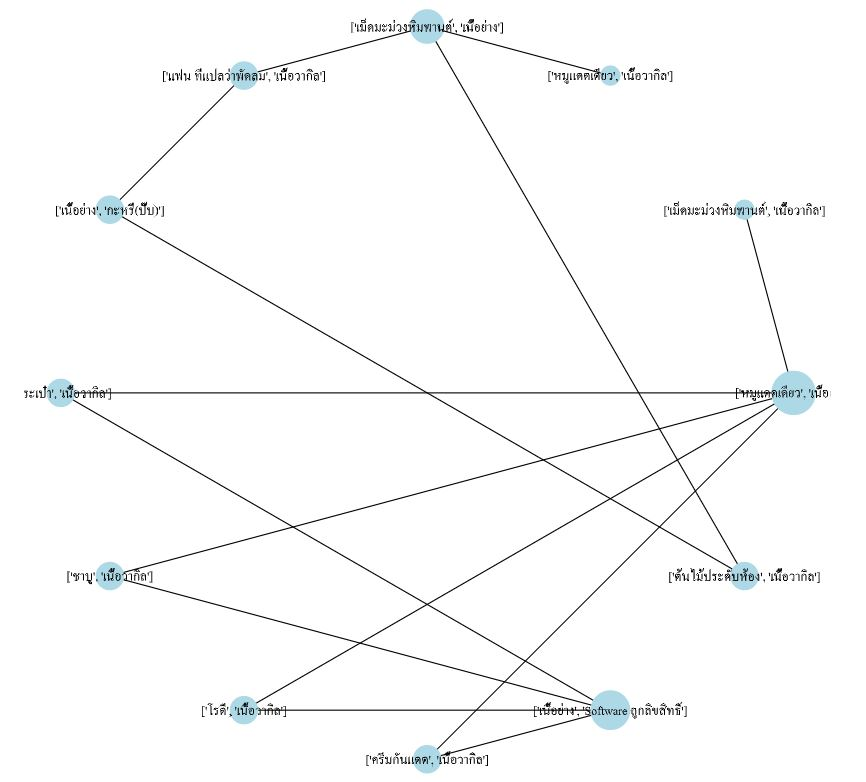
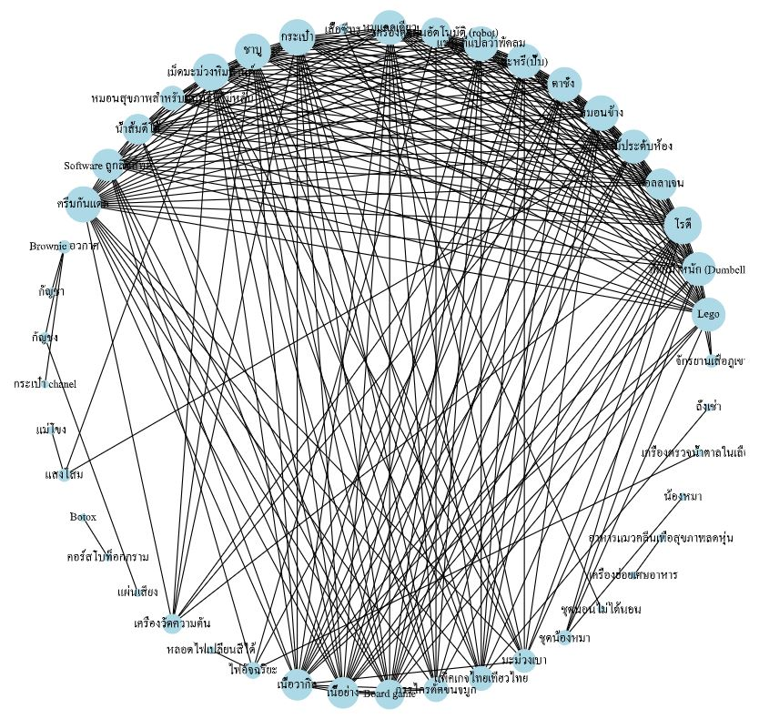
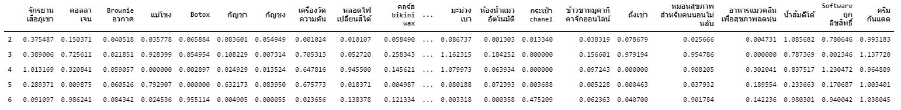
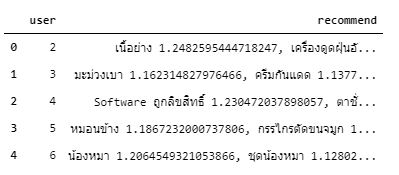

# Product Recommendation
   

## Dataset
สร้างจากผู้เรียนในห้องช่วยกันคิดขึ้นมาว่าเคยซื้อสินค้าอะไรบ้าง ซึ่งรวบรวมได้ทั้งหมด 60 สินค้า และนำมาสร้างเป็นแบบสอบถาม เพื่อให้ช่วยกันตอบว่าใคร "เคยซื้อ" และ "ไม่เคยซื้อ" สินค้าที่กำหนดขึ้นมา โดยมีผู้ร่วมตอบแบบสอบถามทั้งหมด 44 คน 

## Top 20 Most and Least items purchase
สินค้าที่ถูกซื้อมากที่สุด ได้แก่ ครีมกันแดด, กระเป๋า, ชาบู
สินค้าที่ถูกซื้อน้อยที่สุด ได้แก่ PS5, เครื่องย่อยเศษอาหาร, ห้องน้ำแมวอัตโนมัติ

## Association Rule Mining
Association Rule เป็นวิธีการหาว่าเมื่อซื้อสินค้าชิ้นไหนและจะซื้อชิ้นไหนตามมาด้วย (A -> B) 
จากการสร้าง model สามารถสร้างกฎออกมาได้ถึงหลายแสนกฎ แต่ที่สนใจจะแบ่งออกเป็น 2 รูปแบบ คือ
1. เมื่อซื้อสินค้า 1 ชิ้นแล้วชิ้นถัดไปจะซื้ออะไร โดยมีค่า Confidence > 0.5 และ Lift > 1.05

พบว่าได้กฎของการซื้อสินค้า 1 ชิ้นและซื้ออีก 1 ชิ้น เช่น ซื้อกะหรี่ปั๊บแล้วจะซื้อน้ำส้มดีโด้ หรือ ซื้อ Lego และจะซื้อต้นไม้ประดับห้อง

2. เมื่อซื้อสินค้า 2 ชิ้นแล้ว 2 ชิ้นถัดไปจะซื้ออะไร โดยมีค่า Confidence > 0.9 และ Lift > 1.35

พบว่าได้กฎของการซื้อสินค้า 2 ชิ้นและซื้ออีก 2 ชิ้น เช่น ซื้อเม็ดมะม่วงหิมพานต์พร้อมเนื้อย่างแล้วจะซื้อหมูแดดเดียวและเนื้อวากิว

## Collaborative Filtering Model
Collaborative Filtering Model เป็นการหาความสัมพันธ์ระหว่างสินค้าและสินค้า (Item-Item) โดยใช้ค่า cosine เป็นตัวบ่งบอกความสัมพันธ์ เมื่อ cosine มีค่าเข้าใกล้ 1 แปลว่าสินค้า 2 ชิ้นมีความสัมพันธักันมาก หรือแปลได้ว่าสินค้า 2 ชิ้นนี้ควรแนะนำให้แก่กันเมื่อซื้อสินค้าชิ้นใดชิ้นหนึ่ง ในทางกลับกันเมื่อ cosine มีค่าเข้าใกล้ 0 แปลว่าสินค้า 2 ชิ้นมีความสัมพันธ์กันน้อย แปลว่าไม่ได้ถูกซื้อด้วยกัน ไม่ต้องแนะนำสินค้าให้แก่กันเมื่อซื้อสินค้าชิ้นใดชิ้นหนึ่ง

จากการสร้าง model ต้องการดูสินค้าที่มีค่า cosine > 0.6 พบว่าสินค้าที่ควรแนะนำให้แก่กัน เช่น Brownie อวกาศและกัญชา หรือ น้องหมาและชุดน้องหมา เป็นต้น

## Non-negative Matrix Factorization
Non-negative Matrix Factorization เป็นการหาความสัมพันธ์ระหว่างผู้ซื้อและสินค้า (User-Item) โดยการสร้าง model ที่เรียนรู้ Latent Factor ขึ้นมาเพื่อบอกว่าผู้ชื้อน่าจะชอบสินค้าอะไร โดยเมื่อค่ามีมากขึ้นเท่าไหร่แปลว่าผู้ซื้อน่าจะชอบสินค้านั้นมากตามค่านั้น

จากการหา Matrix Factorization จะได้ว่าผู้ซื้อคนไหน น่าจะซื้อสินค้าชิ้นไหน เช่น ผู้ซื้อเลข 2 น่าจะต้องการซื้อครีมกันแดด หรือผู้ซื้อเลข 5 น่าจะต้องการซื้อแม่โขง
และจาก Matrix Factorization สามารถเรียงตามค่า value เพื่อแนะนำสินค้าให้แก่ผู้ซื้อรายคนตามนี้

- สำหรับผู้ซื้อเลข 4 ควรแนะนำ Software ถูกลิขสิทธิ์ และตาชั่ง
- สำหรับผู้ซื้อเลข 6 ควรแนะนำน้องหมาและชุดน้องหมา

## Conclusion
สำหรับการสร้าง Product Recommendation เป็นการหาว่าควรจะแนะนำสินค้าชิ้นไหนให้แก่ผู้ซื้อ โดยอ้างอิงจากการซื้อหรือความชอบของผู้ซื้อต่อสินค้า หรือจะเลือกหาความสัมพันธ์ระหว่างสินค้ากับสินค้าก็ได้เช่นกัน การเลือกใช้ขึ้นอยู่กับข้อมูลที่เรามี
- ถ้าต้องการหาว่าเมื่อซื้อสินค้าชิ้นไหนและควรแนะนำชิ้นไหนสามารถใช้วิธี Association Rule และ Collaborative Filtering แบบ Item-Item
- ถ้าต้องการแนะนำสินค้าแก่ผู้ซื้อเรื่องตามความน่าจะชอบสามารถใช้วิธี Non-negative Matrix Factorization