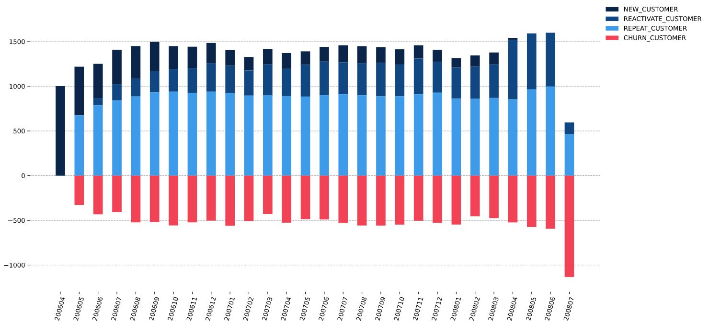

## Customer Movement Analysis
   

## Dataset
เป็นข้อมูล Transections ของ Supermarket แห่งหนึ่งที่บอกว่าลูกค้าซื้อสินค้าอะไรบ้าง จากร้านค้าสาขาไหน ช่วงวันที่เท่าไหร่ มีจำนวนข้อมูลทั้งหมด 956,575 Transections และเป็นข้อมูลระหว่างช่วง 2006/04 ถึง 2008/07

## Objective
ต้องการรู้ว่าในแต่ละเดือน
- มีลูกค้าใหม่เป็นจำนวนกี่คน (New) ซึ่งต้องเป็นลูกค้าที่ไม่เคยซื้อของกับทางร้านมาก่อน
- มีลูกค้าที่กลับมาซื้อซ้ำเป็นจำนวนกี่คน (Repeat) คิดจากเดือนก่อนหน้าต้องมีการมาซื้อของกับทางร้าน
- มีลูกค้าที่เคยซื้อแล้วเลิกซื้อแล้วกลับมาซื้ออีกครั้งเป็นจำนวนกี่คน (Reactivated) คิดจาก 2 เดือนก่อนได้ซื้อของและเว้นไป 1 เดือนและกลับมาซื้ออีกรอบ
- มีลูกค้าที่ที่เลิกซื้อของเป็นจำนวนกี่คน (Churn) คิดจากเดือนก่อนหน้าซื้อของแต่เดือนปัจจุบันไม่ได้มาซื้อแล้ว

## Criteria
สามารถสร้างเกณฑ์การคำนวณออกมาได้ในรูปแบบตาราง ดังนี้
| Status | Before | Previous | Current |
| --- | --- | --- | --- |
| New | ❌ | ❌ | ✅ |
| Repeat | | ✅ | ✅ |
| Reactivated | ✅ | ❌ | ✅ |
| Churn | | ✅ | ❌ |

## Steps
1. Upload Supermarket Data.csv ไปที่ Google Cloud Storage
2. Query ผ่าน BigQuery ตามไฟล์ query.sql
3. Export data มาเป็น CSV ชื่อ results.csv และนำมา plot ผ่าน Matplotlib ตามไฟล์ notebook.ipynb

## Result

จากผลลัพธ์พบว่า 200807 มีลูกค้า Churn มากกว่าปกติ แปลว่า 200806 เกิดอะไรขึ้นสักอย่าง ซึ่งเป็นเบาะแสที่บอกว่าควรไปดูว่าเกิดอะไรขึ้นในเดือน 200806

## Conclusion
สำหรับการทำ Customer Movement Analysis เป็นการทำเพื่อวิเคราะห์ว่าในแต่ละเดือนมีลูกค้ารายใหม่เพิ่มกี่คน ลูกค้าที่ซื้อต่อเนื่องกี่คน ลูกค้าที่หยุดซื้อและกลับมาซื้อกี่คน และลูกค้าที่เลิกซื้อกี่คน เพื่อที่จะได้รู้ว่าแต่ละเดือนควรดำเนินการทางธุรกิจแบบไหน และสามารถรู้ได้ว่าขณะนั้นธุรกิจเกิดปัญหาอะไรขึ้น ตัวอย่างเช่น เมื่อทำ Campaign ใหม่ออกมาเพื่อต้องการดึงลูกค้าใหม่ สามารถวัดผลได้ว่า Campaign นั้นสามารถสร้างลูกค้าใหม่ขึ้นได้กี่คน เป็นต้น