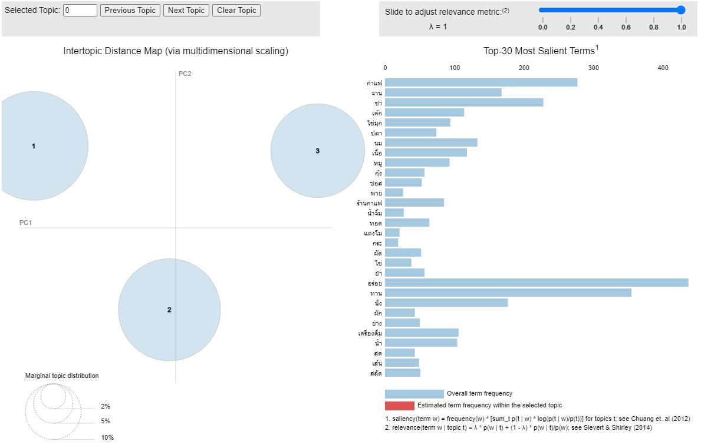
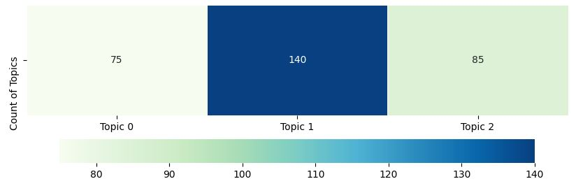

## Voice of Customers
   

## Dataset
เป็นข้อมูลรีวิวร้านอาหารชาบูจากลูกค้าที่ได้รีวิวผ่าน Wongnai ทั้งหมด 300 รีวิว

## Objective
ต้องการรู้ว่าลูกค้ารีวิวร้านในมุมมองไหนบ้าง

## Text Preprocessing
- ลบ Puncutation
- ลบ space
- ลบตัวเลข
- ตัดคำด้วย pythainlp และใช้ engine เป็น newmm
- ลบคำที่ไม่เกี่ยวข้องออก เช่น 'นะคะ', 'เค้า'

## Topic Modeling by LDA
จากการทดลองได้เลือกจำนวน Topic จากการดู LDA Visualization ว่า Intertopic Distance Map ที่จำนวน Topic เท่าไหร่มีการกระจายตัวดีที่สุด และได้เลือกจำนวน Topic 3 Topics

โดยแต่ละ Topic ได้คำตามนี้
- Topic 1: อร่อย, ทาน, รสชาติ, ดี, กิน, จาน, อาหาร, เนื้อ, หมู, เมนู, สั่ง, น้ำ, หวาน, ปลา, ราคา, รส, กุ้ง, ชอบ, โต๊ะ, หอม, ดู, ส้มตำ, ใส่, ลอง, ซอส, ทอด, บาท, กรอบ, ", เส้น
- Topic 2: กาแฟ, อร่อย, กิน, ดี, ทาน, รสชาติ, นั่ง, สั่ง, ราคา, ชา, ชอบ, เค้ก, เมนู, ลอง, หวาน, บาท, บรรยากาศ, อาหาร, บริการ, ร้านกาแฟ, เครื่องดื่ม, นม, ดู, แก้ว, รส, ขาย, หอม, เลือก, เย็น, ร้อน
- Topic 3: รสชาติ, อร่อย, เมนู, ชา, อาหาร, ราคา, ดี, บาท, สั่ง, ทาน, จาน, นม, กิน, ชอบ, กาแฟ, ไข่มุก, หวาน, เลือก, เนื้อ, หอม, น้ำ, ", ลอง, ดู, เครื่องดื่ม, นั่ง, ที่นี่, บรรยากาศ, ยำ, ไทย

จากทั้ง 3 Topics จะได้คำซ้ำ คือ ราคา, หอม, เมนู, ลอง, สั่ง, หวาน, ดี, ทาน, กิน, อาหาร, รสชาติ, บาท, อร่อย, ดู, ชอบ

และเมื่อนำแต่ละ Topic มาลบคำที่ซ้ำกันออกจะได้
- Topic 1: จาน, เนื้อ, หมู, น้ำ, ปลา, รส, กุ้ง, โต๊ะ, ส้มตำ, ใส่, ซอส, ทอด, กรอบ, ", เส้น
- Topic 2: กาแฟ, นั่ง, ชา, เค้ก, บรรยากาศ, บริการ, ร้านกาแฟ, เครื่องดื่ม, นม, แก้ว, รส, ขาย, เลือก, เย็น, ร้อน
- Topic 3: ชา, จาน, นม, กาแฟ, ไข่มุก, เลือก, เนื้อ, น้ำ, ", เครื่องดื่ม, นั่ง, ที่นี่, บรรยากาศ, ยำ, ไทย

จากข้อมูลรีวิวทั้งหมด 300 รีวิว แบ่งเป็น Topics ได้

## Result
จากการเลือก Topic 3 Topics สามารถสรุปได้ว่าแต่ละ Topic พูดถึงเรื่อง
Topic 1: ความอร่อย ราคา และ อาหารคาว
Topic 2: ความอร่อย ราคา และ เครื่องดื่ม
Topic 3: ความอร่อย ราคา และ บรรยากาศ
ซึ่งจากรีวิวทั้งหมดพบว่าพูดถึง Topic 2, Topic 3 และ Topic 1 ตามลำดับ

## Conclusion
สำหรับการทำ Voice of Customers เป็นการทำเพื่อวิเคราะห์ว่าลูกค้าได้พูดถึงร้านค้าหรือแบรนด์ในมุมมองไหนบ้าง เพื่อให้เกิดความรู้และความเข้าใจว่าลูกค้าต้องการอะไร ความคาดหวังลูกค้า และเมื่อทราบสามารถนำมาแบ่ง Clusters ของกลุ่มลูกค้าได้ รวมถึงต่อยอดในการทำ Customer Engagement ได้ต่อในอนาคต